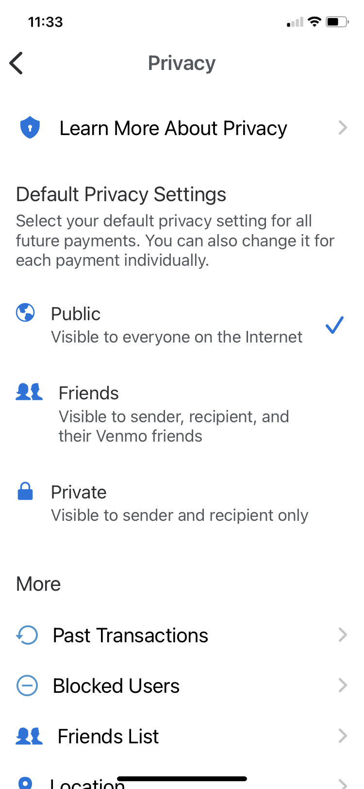

# A tutorial

Like any bank account, Venmo allows you to send, and receive, funds. Also like any bank account a fair amount of setup is required! There are several screens to follow to achieve anonymity in the sending, and receiving, of contributions. Here goes a tutorial to walk us through the steps to achieve anonymity and connection to your funds. Contributing is very simple once everything in your Venmo account is set up. If you have Venmo already installed, and set up for anonymity, just jump ahead to the very last section of this tutorial: Contribute funds. Thanks!

# Install Venmo

1. Find your **applications store on your iPhone screen**. It is the **A in a blue button.**

{ width=20% }

2. Search for the Venmo app next. 

{ width=20% }

3. Several bank and/or Venmo apps might appear. You will only need **the base Venmo app**. Choose this one.

{ width=20% }

4. If you had already installed Venmo before, like here, you will see a cloud icon, otherwise, a Get icon appears. Click this.

{ width=20% }

5. Start up Venmo. Click Personal to get started. Sign up.

{ width=20% }

# Setting up your account

6. Immediately a verification process begins. Type your iPhone number in to get a 4 digit verification number in your text.

{ width=20% }

7. Enter the verification number next.

{ width=20% }

8. This is like any bank. Further information will be required.

{ width=20% }

9. Agree to the terms to continue.

{ width=20% }

10. Then there's legal after all of this.

{ width=20% }

# Friends and anonymity

## Basic privacy

11. We can skip contact for friends for now without any loss of function.

{ width=20% }

12. Set everyting to Private to begin to be anonymous. This is **not** the only setting you need to configure for anonymmity.

{ width=20% }

13. Find Settings by clicking the (very small, blue) people icon on the bottom right.

{ width=20% }

14. In Settings click on Privacy.

{ width=20% }

15. In Privacy click on Private (again).

{ width=20% }

Another category to go if you want to be anonymous across friends, as we usually do.

## Friends privacy

16. Go back to settings (click little blue person icon at the bottom right). Click on Friends List this time.

{ width=20% }

17. Set Friends List to Private.

{ width=20% }

And yet another category regarding who can see our transactions is next.

## Past transactions

18. In Settings (click little blue person icon at the bottom right or just click < at top left) click on Past Transactions next. You will see this screen.

{ width=20% }

19. Make Past Transactions **private**. If you do not, the fact that you contributed will be seen by all in the group.

{ width=20% }

# Payment methods

With privacy settings we can maintain anonymity. Your last setup step is to connect with your bank. Although not shown, similar steps will connect Venmo with a credit card. [Please click here to access Venmo for further information on adding credit cards and associated fees.](https://help.venmo.com/hc/en-us/articles/210413677-Adding-a-Credit-or-Debit-Card)

20. Return to Settings (you can click < at the top left), and click on Payment Methods where you can Add (a) Bank.

{ width=20% }

21. Click on Add Bank.

{ width=20% }

22. Now Venmo will reach out to verify your bank using the Plaid service.

{ width=20% }

23. Venmo will offer several banks to choose from, for example Chase. Follow the directions (they might be different for different banks). You will be asked to log into your bank, or otherwise provide account information. The Venmo-Plaid-Bank process will eventually connect Venmo with your bank, and your funds. Venmo uses a similar process for credit cards.

{ width=20% }

24. If Venmo can verify all of your bank (or credit card) information you will reach this screen. Just click on the Pay or Request button to begin to contribute.

{ width=20% }

Finally, you have reached your last steps in this process. You can now contribute funds to your group.

# Contribute funds

25. Getting Started! Just click on the button.

{ width=20% }

26. Type 5164274990 and an amount in the top field. Type Basket in the description field. Emojis will more than likely appear. You can turn these off in Settings.

{ width=20% }

{ width=20% }

27. Your transaction will appear (if successful). Names are blotted out here to protect anonymity.

{ width=20% }

